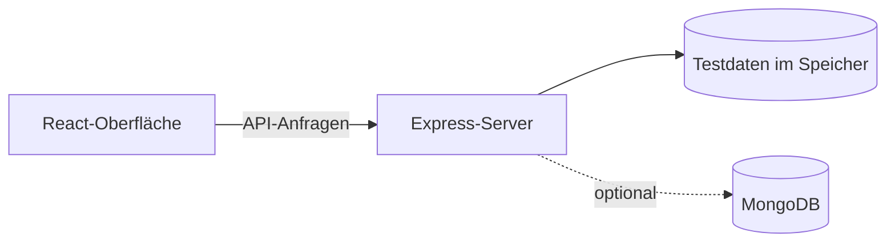

# Mein Lernshop

Dieses Projekt habe ich gebaut, um React und Node.js praktisch zu üben. Es ist kein fertiger Online-Shop, sondern ein Lernprojekt.


## Was funktioniert?

- Produkte anzeigen, suchen und nach Kategorien filtern
- Registrierung und Login
- Warenkorb bearbeiten
- Eine Testbestellung anlegen
- Bestellungen wieder anzeigen

Es gibt keine echte Bezahlung und keine echten Kundendaten.

## So ist das Projekt aufgebaut



Die Oberfläche und die API laufen getrennt. Ohne eine MongoDB-Verbindung benutzt der Server Testdaten im Arbeitsspeicher.

## Verwendet

- React und Vite für die Oberfläche
- Node.js und Express für die API
- JWT für den Login
- MongoDB kann optional benutzt werden

Ohne MongoDB läuft das Projekt mit Testdaten im Arbeitsspeicher. So kann man es einfacher ausprobieren.

## Starten

Benötigt werden Node.js 20.19 oder neuer und npm.

```powershell
npm install
npm run dev
```

Danach im Browser öffnen:

`http://127.0.0.1:5173`

## Für eine Veröffentlichung

Nach `npm run build` kann der Express-Server die gebaute Oberfläche zusammen mit der API ausliefern:

```powershell
npm start
```

Der Server benutzt automatisch den Port aus der Umgebungsvariable `PORT`. Für eine öffentliche Installation sollte außerdem ein eigenes `JWT_SECRET` gesetzt werden.

## Testen

```powershell
npm test
npm run build
```

Die Tests prüfen unter anderem Registrierung, Login, geschützte Routen, getrennte Warenkörbe und eine Testbestellung.

## Was ich dabei gelernt habe

Bei diesem Projekt habe ich geübt, wie eine React-Oberfläche mit einer eigenen API zusammenarbeitet. Außerdem habe ich mich mit Login, Formularen, einem Warenkorb und einfachen Tests beschäftigt.

Das Projekt ist noch eine Übung und kann später weiter verbessert werden.
